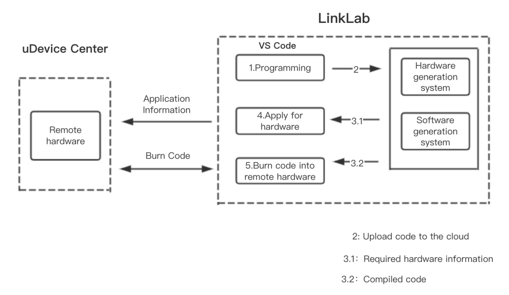
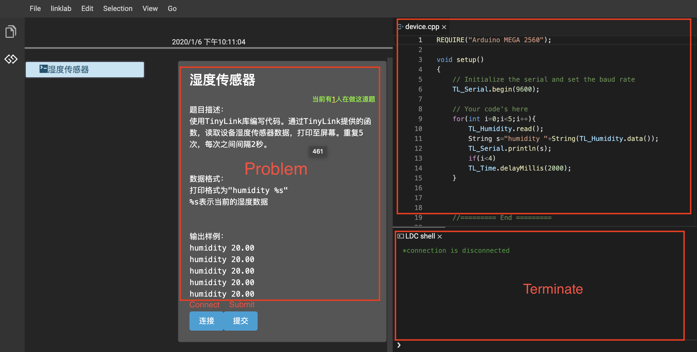
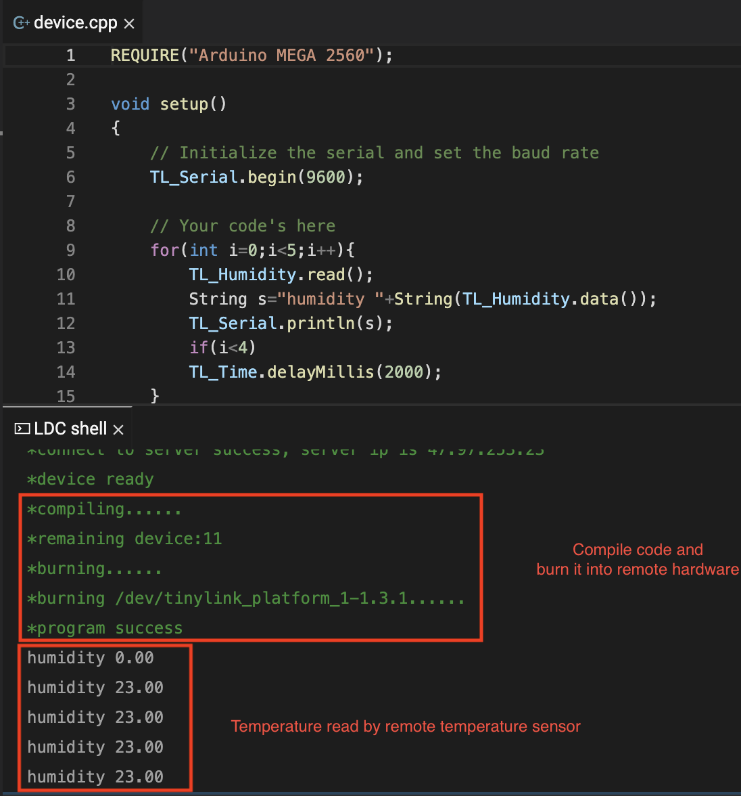

# LinkLab - an IoT teaching platform

One characteristic of IoT applications is the heterogeneity of devices. An IoT application often contains many different types of devices. The heterogeneity of devices brings two major problems to application development. First, the learning cost is high. For different devices, developers need to set up different development environments and learn different development languages, which leads to the increase of the development and learning cost of the IoT device side. Second, the equipment selection and application testing are difficult. Faced with a wide variety of devices, how to choose the device that is most suitable for a specific application is very difficult for developers unfamiliar with IoT hardware.

In response to the first problem, this system uses a unified programming language and cloud compilation technology to shield the development differences between different hardware and reduce the difficulty of application development on the IoT device side. For the second one, Alibaba has launched the IoT online development board / device platform (uDevice Center) to move the device online. Developers can use a variety of IoT devices remotely without purchasing, reducing equipment Difficulty in selecting and applying tests.

When users perform IoT experiments in the LinkLab, they only need to use a unified programming language to write the IoT applications that they need to develop. The platform will compile the code in the cloud and burn it into specific hardware in uDevice Center. LinkLab makes traditional IoT application development as easy as software development. The LinkLab architecture diagram is shown below.

<table>
  <tr>

<td><b>Homepage:</b></td>
<td><a href="http://linklab.tinylink.cn/">linklab.tinylink.cn</a></td>

  </tr>

<tr>

<td><b>uDevice Center</b></td>
<td><a href="https://github.com/alibaba/AliOS-Things/wiki/uDevice-Center">uDevice Center</a></td>

  </tr>

</table>

## Getting Started

Next, a simple demonstration of the function of the system.

- Log in to the system and enter the experiment page.

  

- Select an IoT experiment, read the temperature from the temperature sensor and display it on the terminal.

  

- Upload the code to the cloud for compilation, and then burn the compiled code into the temperature sensor device in uDevice Center.

  

## My Responsibilities

- Studied the design documentation of LinkLab and use of some related platforms such IoT Studio and TinyLink.

- Completed the test tasks of the teaching experiment module of the LinkLab and wrote a testing report.
- Plan to participate in the optimization part of code cloud compilation later.
- Plan to participate in the editor with intelligent code hinting later.